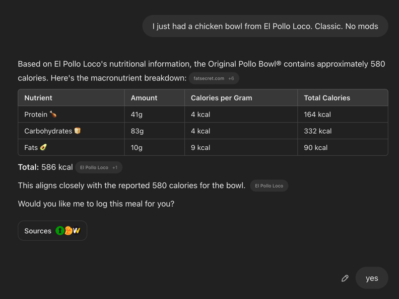
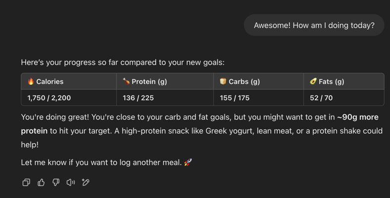
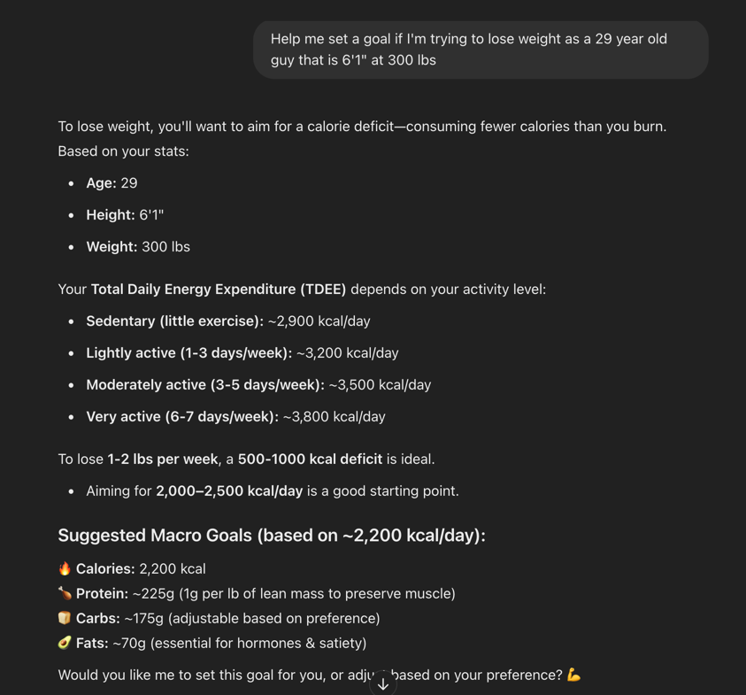

# Diet Tracker Terraform Deployment

This project deploys a Diet Tracking Application backend using AWS Lambda, DynamoDB, API Gateway, and IAM roles. Terraform provisions all required resources, and deployment/teardown are managed through a Makefile.

## Prerequisites

- **Terraform** (v0.12+ recommended)
- **AWS CLI** configured with credentials that have the necessary permissions.
- **zip** utility installed (used to package the Lambda function).

## IAM Permissions

Make sure that you're logged into the AWS CLI with a user account containing AdminAccess.

## Deployment

The deployment is managed by a Makefile that integrates the steps to package the Lambda function, initialize Terraform, create a plan, and apply the changes.

### To Deploy Resources

Run the following command from the project root (you can specify a custom namespace if desired):

```bash
make deploy NAMESPACE=mycustomnamespace
```

## Destroying Resources

To tear down all resources created by this deployment, use the following command:

```bash
make destroy NAMESPACE=mycustomnamespace
```

This command will remove all deployed AWS resources managed by Terraform. **Caution:** Ensure you want to delete these resources as this action cannot be undone.

## Post-Deployment Verification

After a successful deployment, verify that the resources are properly set up by:
- Checking the AWS Lambda console for the deployed function.
- Confirming that DynamoDB tables (`DietGoals`, `MealLogs`, `ValidUsers`) are created.
- Verifying the API Gateway endpoints using tools such as Postman or cURL.
- Reviewing CloudWatch logs for any errors or execution details of the Lambda function.

## Updating the Lambda Function

To update the Lambda function code:

1. Modify the `lambda_function.py` file as needed.
2. Redeploy the changes with:

   ```bash
   make deploy NAMESPACE=mycustomnamespace
   ```

## Adding a User

After deploying, you can add users to the application.

1. Request or assign a passphrase from the user.
2. Submit the passphrase to the user database:

   ```bash
   ./generated_resources/add_valid_user.sh "<passphrase>"
   ```

3. Send instructions in `new_user_instructions.txt` and `openapi.yaml` to the new user.

## Demo Photos
### Meal Logging


### Diet Diary Checking


### Personalized Goal Setting



## Troubleshooting

- **Terraform Plan Fails:** Verify that your AWS CLI credentials are correctly configured and that you have sufficient IAM permissions.
- **Resource Conflicts:** If you encounter issues with resource names (e.g., duplicates), consider using a unique namespace.
- **Lambda Deployment Errors:** Check CloudWatch logs for detailed error messages regarding the Lambda function.
- **API Gateway Issues:** Ensu